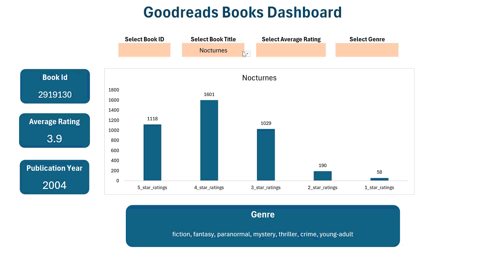

# 📚 Goodreads Books – Excel Dashboard

An interactive Excel dashboard analyzing Goodreads book performance using dynamic charts and automated formulas.
The dashboard provides insights into:

⭐ Average book ratings

📊 Ratings breakdown (1–5 star ratings)

📘 Book title & ID

📂 Genre

📅 Publication year

The data updates automatically when you select a different book from the dropdown.

## 🔍 Features

Fully interactive Excel interface

Drop-down book selector

Automated summary cards

Clean visual layout using Excel charts

Ratings comparison chart

Genre and publication year insights

## 📁 Files Included
| File                             | Description           |
| -------------------------------- | --------------------- |
| `Goodreads_Books_Dashboard.xlsx` | Main Excel dashboard  |
| `README.md`                      | Project documentation |
| `Dashboard_goodreads_books.png`  | Dashboard Screenshot  |
| `Dashboard_goodreads_books.mp4`  | Dashboard Video       |
| `Goodreads_books_dashboard.gif`  | Dashboard gif         |

## 📸 Dashboard Screenshot

## 📸 Dashboard Video

## 🛠 Tools Used

Microsoft Excel

Excel formulas

Conditional formatting

Charts & Visualizations

Clean data preparation
